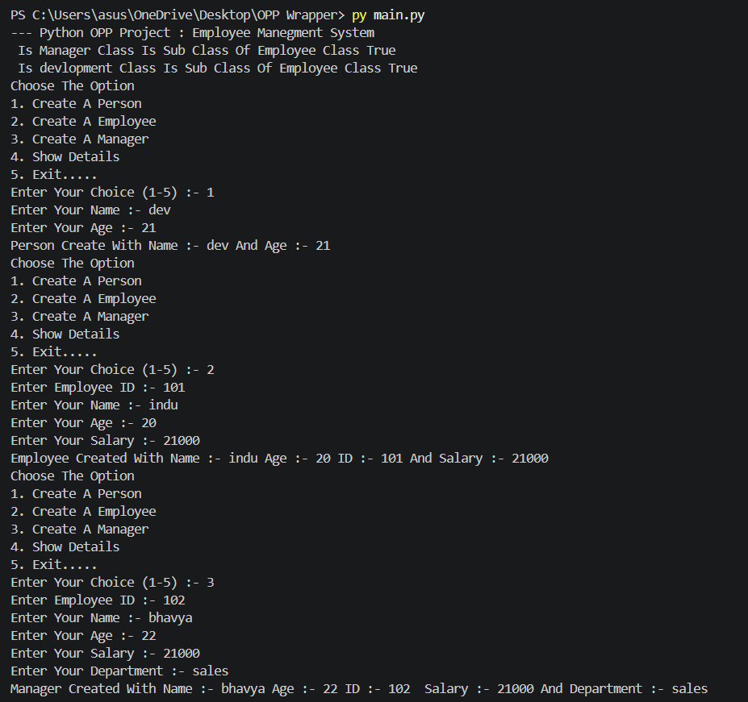

# Employee Management System 

## Subtitle
A Python OOP-based Employee Management System for creating and managing Persons, Employees, and Managers using Object-Oriented Programming concepts
---

# Features

- Create a Person
- Create a Employee
- Create a Manager
- Display Person details
- Display Employee details
- Display Manager details
- Employee ID management
- Employee salary management
- Manager department management
- Demonstrates class inheritance
- Demonstrates parent-child class relationships
- Checks whether Employee and Manager classes are subclasses of Person and Employee

---

# Technologies Used

- **Programming Language:** Python

- **Editor:** VS Code 

---

# Concepts Used

The following Python concepts are used in this project:

- Classes
- Objects
- Constructors (`__init__`)
- Inheritance
- Single Inheritance
- Parent Class
- Child Class
- Methods
- Instance Variables
- `issubclass()`
- User Input
- Conditional Statements
- While Loop
- Menu-Driven Programming

---

# How To Use

1. Run the Python program.
2. Select The  option .

```
1. Create A Person
2.  Create A Employee
3. Create A Manager
4. Show Detail 
```

3. Enter your choice.
4. Provide required data input.
5. View the generated output.

---

# Installation

### Step 1: Install Python

Download and install Python from:

```
https://www.python.org/
```

### Step 2: Clone or Download Project

Download the project files into your system.

### Step 3: Run Program

Open terminal:

```
python main.py
```

---

# Example Output

```
Python OPP Project : Employee Manegment System 

Choose The Option :- 1

Enter Your Name :- dev
Enter Your Age :- 21
Person Create With Name :- dev And Age :- 21

Choose The Option  :- 2


Enter Employee ID :- 101
Enter Your Name :- devi
Enter Your Age :- 21
Enter Your Salary :- 21000
Employee Created With Name :- dev Age :- 21 ID :- 101 And Salary :- 21000

Enter Your Choice (1-5) :- 3
Enter Employee ID :- 102
Enter Your Name :- deva
Enter Your Age :- 21
Enter Your Salary :- 21000
Enter Your Department :- sales
Manager Created With Name :- deva Age :- 21 ID :- 102  Salary :- 21000 And Department :- sales

Enter Your Choice (1-5) :- 4
Enter Your Choose 
1. Show Person
2. Show Employee
3. Show Manager


Enter Your choose (1-3):- 1

Employee id is None
Employee name  is dev
Employee age  is 21
Employee salary  is None

Enter Your choose (1-3):- 2
Employee id is 101
Employee name  is devi
Employee age  is 21
Employee salary  is 21000

Enter Your choose (1-3):- 3
Employee id is 102
Employee name  is deva
Employee age  is 21
Employee salary  is 21000
Manager Department is sales

Enter Your Choice (1-5) :- 5
GoodBye...

```


### Output 



---

# Project Structure

```

│
├── README.md
│
├── main.py
│
└── output.png
    
```

---

# Author

**Dev Thakkar**
